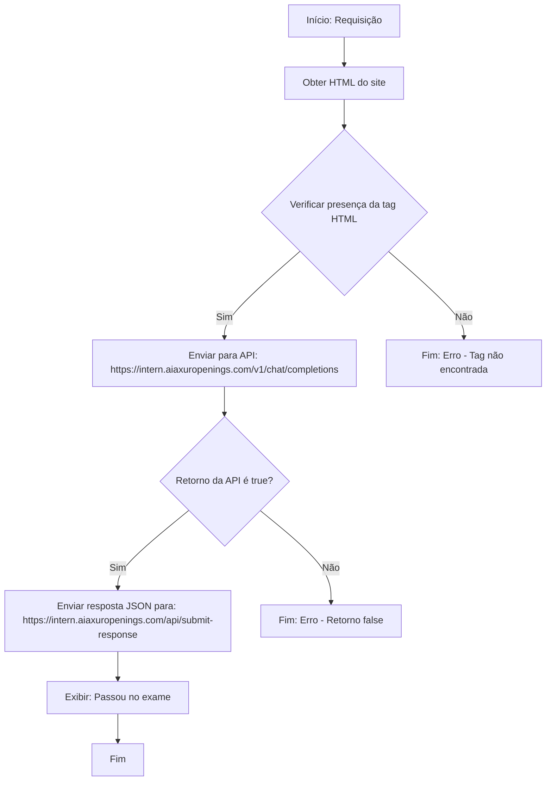

# Repositório intern-aiaxur

Bem-vindo ao repositório `intern-aiaxur`

## Objetivo do Repositório

Este repositório contém o código-fonte de uma aplicação desenvolvida para o desafio técnico do processo seletivo da AIAxur. A aplicação realiza a captura de conteúdo HTML de um site, verifica a presença de uma tag HTML específica e, com base no resultado, interage com APIs fornecidas pela AIAxur, exibindo o resultado do exame ao final do processo.

## Pré-requisitos

Antes de começar, certifique-se de que você possui os seguintes requisitos instalados em sua máquina:

- **Python 3.8+**: Necessário para executar o script principal.
- **Bibliotecas Python**:
  - `requests`: Para realizar requisições HTTP.
  - `beautifulsoup4`: Para parsing de HTML.
- **Git**: Para clonar o repositório.
- **Ambiente de desenvolvimento**: Um editor de código (como VS Code) ou uma IDE para facilitar a edição e execução do código.
- **Acesso à internet**: Necessário para interagir com as APIs fornecidas.

### Instalação das Dependências

1. Clone o repositório para sua máquina local:

   ```bash
   git clone https://github.com/GustavoLaubeSchwartz/intern-aiaxur.git
   ```

2. Acesse o diretório do projeto:

   ```bash
   cd intern-aiaxur
   ```

3. Crie um ambiente virtual (opcional, mas recomendado):

   ```bash
   python -m venv venv
   source venv/bin/activate  # No Windows: venv\Scripts\activate
   ```

4. Instale as dependências listadas no arquivo `requirements.txt`:

   ```bash
   pip install -r requirements.txt
   ```


## Como Usar o Repositório

O repositório contém um script principal que implementa o fluxo do desafio técnico. Siga os passos abaixo para executar o projeto:

1. **Configuração Inicial**:
   - Certifique-se de que o ambiente está configurado corretamente, conforme descrito na seção de pré-requisitos.
   - Verifique se o script principal (ex.: `app.py`) está presente no diretório raiz do repositório.

2. **Execução do Script**:
   - Crie um .env na raiz do projeto, com a variável `OPENAI_API_KEY` e coloque o seu token de acesso
 - 
   - Execute o script principal com o comando:

     ```bash
     python app.py
     ```

   - O script executará as seguintes etapas, conforme descrito no fluxograma abaixo:
     - Faz uma requisição para obter o HTML de um site.
     - Verifica a presença de uma tag HTML específica.
     - Se a tag for encontrada, envia o conteúdo para a API `https://intern.aiaxuropenings.com/v1/chat/completions`.
     - Se o retorno da API for `true`, envia a resposta em formato JSON para a API `https://intern.aiaxuropenings.com/api/submit-response`.
     - Exibe a mensagem "Passou no exame" caso o fluxo seja concluído com sucesso.

3. **Saída Esperada**:
   - Ao final da execução, o programa exibirá uma mensagem indicando se o exame foi concluído com sucesso ou se houve algum erro no processo.

## Fluxo de Processamento

O fluxograma abaixo ilustra o processo implementado no script:



### Explicação do Fluxo

1. **Requisição**: O script inicia fazendo uma requisição HTTP para obter o conteúdo HTML de um site especificado.
2. **Verificação da Tag HTML**: O HTML é analisado para verificar a presença de uma tag HTML específica.
3. **Interação com a Primeira API**: Se a tag for encontrada, o conteúdo é enviado para a API `https://intern.aiaxuropenings.com/v1/chat/completions`.
4. **Validação do Retorno**: O script verifica se o retorno da API é `true`.
5. **Envio do Resultado**: Se o retorno for `true`, a resposta em formato JSON é enviada para a API `https://intern.aiaxuropenings.com/api/submit-response`.
6. **Exibição do Resultado**: Caso todas as etapas sejam concluídas com sucesso, a mensagem "Passou no exame" é exibida.

## Estrutura do Repositório

Abaixo está a estrutura de arquivos do repositório:

```
intern-aiaxur/
├── .github/workflows/
│   # Configurações de CI/CD, como pipelines para automação de testes e integração.
├── assets/
│   # Imagem retornada do site 
├── scripts/
│   # Contém os scripts principais para execução da API.
├── src/
│   # Código-fonte principal do projeto, organizado em módulos reutilizáveis.
│   ├── log/
│   │   # Módulo para gerenciamento de logs, contendo configurações e funções de logging.
├── tests/
│   # Testes unitários e de integração para validar o funcionamento do código.
├── utils/
│   # Funções utilitárias e helpers que suportam o funcionamento do projeto.
├── README.md
│   # Este arquivo, com instruções de uso.
└── requirements.txt
    # Lista de dependências do projeto.

```

## Possíveis Problemas e Soluções

- **Erro ao instalar dependências**:
  - Certifique-se de que está utilizando a versão correta do Python (3.8 ou superior).
  - Verifique se o comando `pip` está associado ao Python correto (use `python -m pip` se necessário).

- **Falha na requisição HTTP**:
  - Verifique sua conexão com a internet.
  - Confirme se as URLs das APIs estão acessíveis e corretas.

- **Tag HTML não encontrada**:
  - Certifique-se de que o site alvo contém a tag esperada.
  - Revise o código de parsing no script para garantir que a lógica está correta.

- **Erro na API**:
  - Verifique se o formato dos dados enviados para as APIs está correto (ex.: JSON bem-formado).
  - Consulte a documentação das APIs para possíveis códigos de erro.

## Contribuições

Este repositório é específico para o processo seletivo da AIAxur e, portanto, não aceita contribuições externas. Caso tenha dúvidas ou sugestões relacionadas ao desafio, entre em contato com a equipe da AIAxur por meio dos canais oficiais fornecidos no processo seletivo.

## Contato

Para dúvidas ou suporte técnico relacionado ao processo seletivo, entre em contato com a equipe da AIAxur pelo e-mail fornecido na descrição do processo seletivo.

---

*Última atualização: 18 de maio de 2025*
